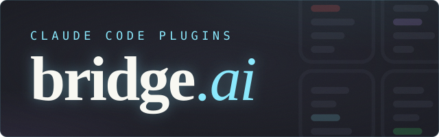

<h1>Chris Peterson</h1>

  I've been writing software for the past few decades

  <picture></picture>
  <picture></picture>
  <picture></picture>
  <picture></picture>
  <picture></picture>
  <picture></picture>
  <picture></picture>
  <picture></picture>

## Current Focus

  

<table>
  <tr>
    <td width="34%"></td>
    <td width="66%">Screens dangerous shell commands before they run</td>
  </tr>
  <tr>
    <td></td>
    <td>Keeps Claude Code and your installed plugins current</td>
  </tr>
  <tr>
    <td></td>
    <td>At-a-glance awareness across concurrent Claude Code sessions</td>
  </tr>
  <tr>
    <td></td>
    <td>Remembers what you were working on between sessions</td>
  </tr>
  <tr>
    <td></td>
    <td>Consistency across issues, reviews, commits, and releases</td>
  </tr>
  <tr>
    <td></td>
    <td>Requirements in source control, synced with the code either direction</td>
  </tr>
  <tr>
    <td></td>
    <td>Project instructions written once, in the file every AI tool reads</td>
  </tr>
  <tr>
    <td></td>
    <td>Shared build tooling behind the bridge.ai plugins</td>
  </tr>
</table>

## Starred Projects

<table>
  <tr>
    <td width="24%"></td>
    <td width="10%"></td>
    <td width="66%">GitLab from PowerShell</td>
  </tr>
  <tr>
    <td></td>
    <td></td>
    <td>Low-ceremony BDD tests for .NET, written in Gherkin</td>
  </tr>
  <tr>
    <td></td>
    <td></td>
    <td>Structured logging for .NET, built for aggregation</td>
  </tr>
  <tr>
    <td></td>
    <td></td>
    <td>Confidence when changing code</td>
  </tr>
  <tr>
    <td></td>
    <td></td>
    <td>Versioning for build artifacts</td>
  </tr>
  <tr>
    <td></td>
    <td></td>
    <td>PowerShell objects to Markdown tables</td>
  </tr>
  <tr>
    <td></td>
    <td></td>
    <td>RabbitMQ administration in a container</td>
  </tr>
  <tr>
    <td></td>
    <td></td>
    <td>My git config, kept as small as it will go</td>
  </tr>
</table>

## Other Projects

<table>
  <tr>
    <td width="34%"></td>
    <td width="66%">One CLI shape over both GitHub and GitLab</td>
  </tr>
  <tr>
    <td></td>
    <td>GitHub from PowerShell</td>
  </tr>
  <tr>
    <td></td>
    <td>File operations for PowerShell</td>
  </tr>
  <tr>
    <td></td>
    <td>A GitHub Action that publishes modules to the PowerShell Gallery</td>
  </tr>
</table>

### Labs

<table>
  <tr>
    <td width="24%"></td>
    <td width="10%"></td>
    <td width="66%">Keyboard-driven diff viewer for reviewing AI-generated code</td>
  </tr>
  <tr>
    <td></td>
    <td></td>
    <td>Coding sessions turned into retros, committed to a team repo</td>
  </tr>
  <tr>
    <td></td>
    <td></td>
    <td>Artifactory from PowerShell</td>
  </tr>
  <tr>
    <td></td>
    <td></td>
    <td>Plugins react to each other's facts without naming each other</td>
  </tr>
  <tr>
    <td></td>
    <td></td>
    <td>Tag your files and let the directory tree follow</td>
  </tr>
  <tr>
    <td></td>
    <td></td>
    <td>Audio metadata from PowerShell, through TagLib#</td>
  </tr>
  <tr>
    <td></td>
    <td></td>
    <td>Yelp from PowerShell</td>
  </tr>
</table>

## Upstream Contributions

  
  
  
  
  
  
  
  
  
  
  
  
  
  
  
  
  
  
  

